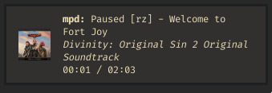

# mpdnd

mpdnd is a notification daemon for MPD.



## Installation

Run `cargo install --git https://github.com/Dophin2009/mpdnd`.

A configuration file at `$XDG_CONFIG_HOME/mpdnd/config.toml` must be
created to look like this:

``` toml
[mpd]
host = "localhost"
port = 6600
library = "~/music"
```

## Usage

See `mpdnd --help`
